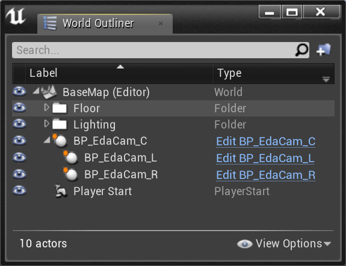
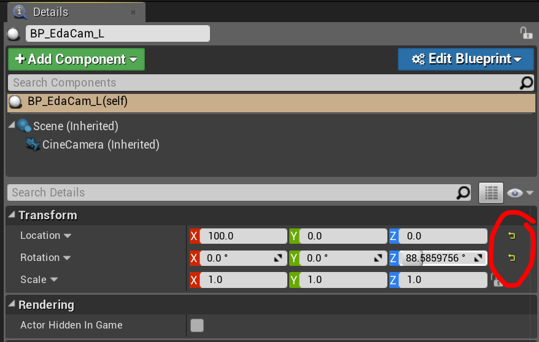

# EDA Render Template

This is an Unreal Engine template project for rendering out cinematic sequences for UCLA's EDA Immersive Projection System in the Broad Art Center.

The template comes with three Blueprint CineCamera Actors, one for each of the three EDA walls, and each camera has its sensor settings and transform (location, rotation, scale) preconfigured for its respective wall. The camera Blueprints can be found in *Content > EdaRender > Core*.

When you want to add a new camera to your scene, the currently recommended procedure is to drag a *BP_EdaCam_C*, a *BP_EdaCam_L*, and a *BP_EdaCam_R* into your scene from the content browser. Then, in your *World Outliner*, drag the newly created *BP_EdaCam_L* and *BP_EdaCam_R* actors onto the new *BP_EdaCam_C* so that they are now attached to it. 

Then reset the location and rotation to default for *BP_EdaCam_L* and *BP_EdaCam_R*.

For reference, see the *BaseMap* and *AnimatedMap* template levels, which are located in *Content > EdaRender > Maps*.
